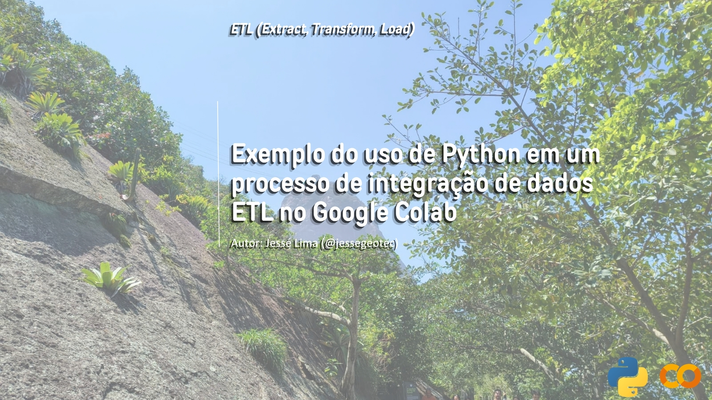
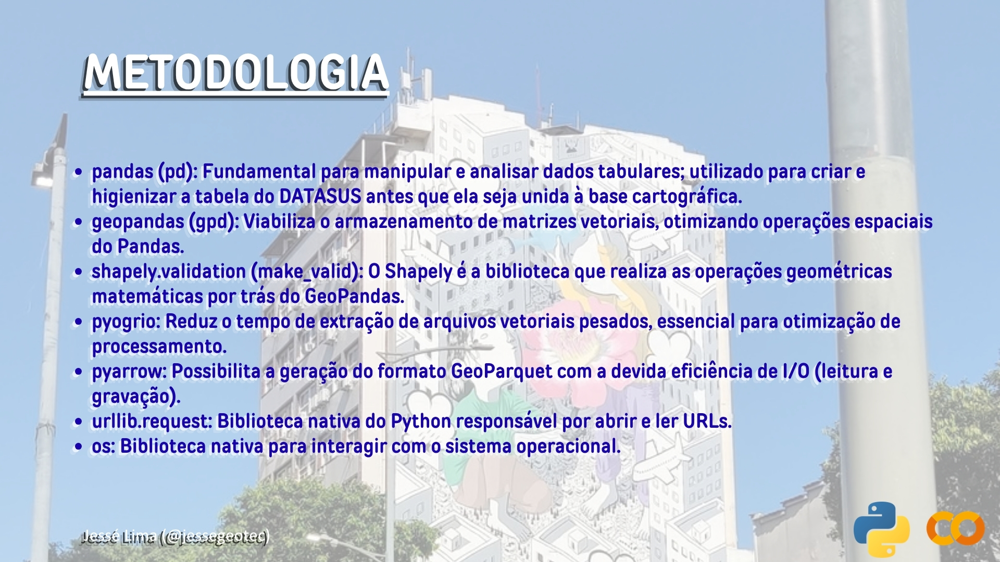
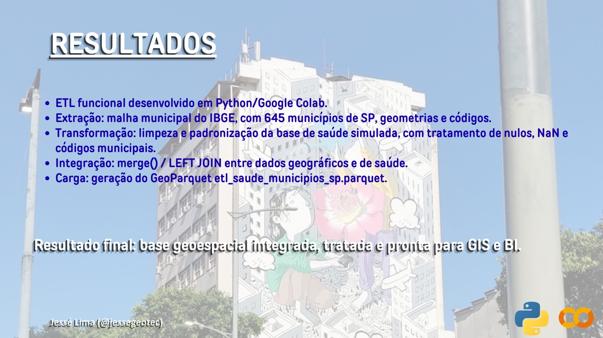

# ETL em Python: Google Colab
### Um Exemplo do uso de Python em um processo de integração de dados ETL no Google Colab

---

## 1. Contextualização e Objetivo
* Este projeto foi desenvolvido com o objetivo de demonstrar competências técnicas em processos de Extração, Transformação e Carga de dados (ETL) utilizando Python no Google Colab. A proposta consiste em integrar uma base cartográfica municipal do Instituto Brasileiro de Geografia e Estatística (IBGE) com uma base de dados de saúde simulada, reproduzindo um cenário comum de integração de informações provenientes de fontes distintas.
* Além de exemplificar conceitos fundamentais da Engenharia e Análise de Dados, o projeto evidencia práticas de automação, tratamento de dados, padronização de informações, integração entre bases e geração de produtos finais compatíveis com ferramentas de Business Intelligence (BI) e Sistemas de Informação Geográfica (GIS). Os dados de saúde utilizados possuem caráter exclusivamente didático e foram simulados para demonstrar o fluxo ETL, não representando informações oficiais do DATASUS.
---

## 2. Metodologia

* O desenvolvimento do ETL foi baseado em bibliotecas amplamente utilizadas em projetos de análise e engenharia de dados. O Pandas foi empregado na manipulação e tratamento das informações tabulares, enquanto o GeoPandas viabilizou o armazenamento e processamento de dados geoespaciais. O Pyogrio foi utilizado para otimizar a leitura dos arquivos vetoriais da malha municipal do IBGE e o PyArrow para exportação do resultado final no formato GeoParquet.
* Complementarmente, as bibliotecas nativas urllib.request e os foram utilizadas para automatizar o download dos dados e realizar interações com o sistema operacional. A metodologia adotada buscou reproduzir um fluxo ETL simplificado, porém alinhado às práticas encontradas em projetos reais de integração de dados.
---

## 3. Processos realizados
* O processo iniciou-se com a extração automática da malha municipal do Estado de São Paulo disponibilizada pelo IBGE. Após o download e leitura do arquivo vetorial, foi criada uma base simulada de saúde contendo códigos municipais, nomes de municípios e indicadores fictícios para fins educacionais.
* Na etapa de transformação, foram executados procedimentos de limpeza textual, tratamento de valores nulos, conversão de tipos de dados e padronização dos códigos municipais utilizados como chave de integração. Em seguida, foi realizado um processo de união entre a base geográfica e a base de saúde por meio da função merge(), equivalente ao comando LEFT JOIN em SQL.
* Por fim, os dados integrados foram carregados em arquivos de saída destinados à consulta, análise e compartilhamento, concluindo o fluxo ETL proposto.
---

## 4. Resultados

* O resultado do projeto consiste em um pipeline ETL funcional desenvolvido em Python e executado no Google Colab. O processo foi capaz de realizar a extração automatizada da malha municipal do IBGE, contendo os 645 municípios do Estado de São Paulo, além de efetuar a limpeza, padronização e integração de uma base simulada de saúde.
* Como produto final, foi gerada uma base geoespacial integrada contendo atributos geográficos e tabulares em um único conjunto de dados, pronta para utilização em análises espaciais, aplicações GIS e ferramentas de Business Intelligence. O projeto evidencia conhecimentos relacionados à manipulação de dados tabulares, dados geoespaciais, integração entre fontes distintas e exportação de resultados em formatos amplamente utilizados no mercado de dados.
  - O notebook está disponível para download em, sendo reprodutível e possuindo todo o código utilizado: [Notebook colab ETL.ipynb](ETL_em_python.ipynb)
  - O Arquivo GeoParquet contendo a base geoespacial integrada está disponível para download em: [Parquet do ETL](etl_saude_municipios_sp.parquet)
  - A versão tabular para inspeção e validação dos dados está disponível para download em: [Planilha p/ Excel do ETL](etl_saude_municipios_sp.xlsx)
---

### **Agradeço pela atenção durante a leitura**

